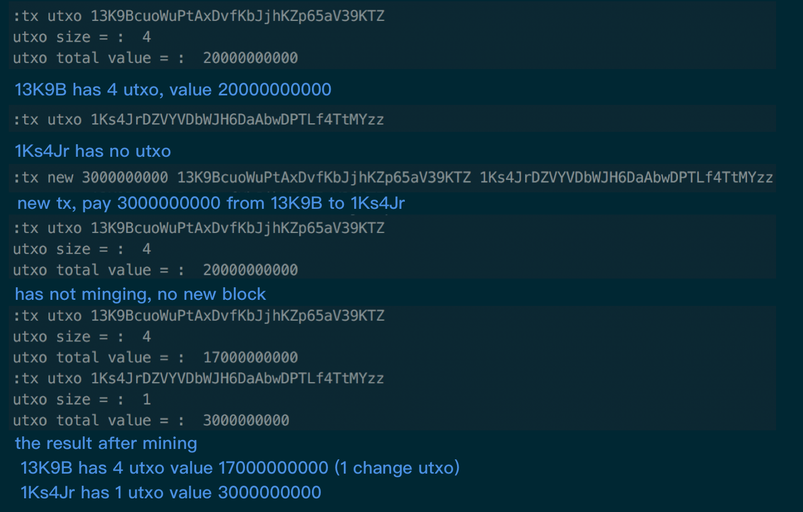
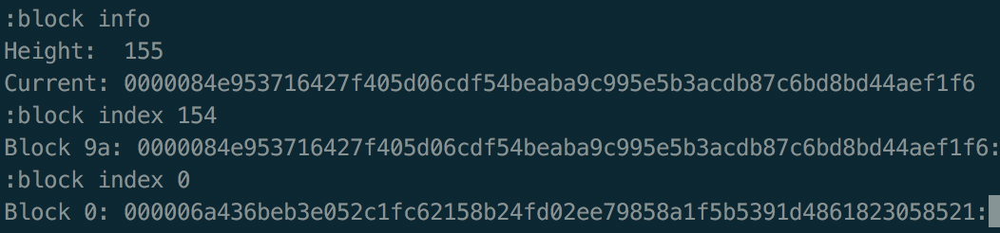

# Bitcoin 原型

### Feature

Bitcoin 的 blockchain，transaction 功能

* key
  * new       `Generate a new Address`
  * list      `List all the Address`
  * default   `Set the default Address, which the Coinbase to lay on`


* tx
  * new       `New a Transaction`
  * utxo      `Find all the utxo of some Address`



* block
  * info      `Show Blockchain Height and Current Hash`
  * index     `Show Hash of the Index Block`



### dep lib

* github.com/jbenet/go-base58
* golang.org/x/crypto/ripemd160
* github.com/golang-collections/collections/stack

### 拆开的三个库

* github.com/yockliu/bitcoinlib

公用方法类库，实现如下功能：

```
- HashCode: Type which is 32 bytes arrqy representing a hashcode
- ByteConvert: Convert uint to byte array
- CompactSizeUint: Varint according to bitcoin data struct (not complete)
- Keys: Function that generate PrivateKey and PublicKey, generate Address, Sign and Check Sign
- Other utils: Better code, Better life
```

* github.com/yockliu/blockchain

实现`blockchain`功能，但解耦了`transaction`功能

```
- Block 序列化协议数据结构
- Blockchain 链式结构
- Merkle Root
- Pow
```

* github.com/yockliu/bitcointx

实现了`transaction`功能

```
- TXIn
- TXOut
- Transaction
- Coinbase
- 序列化成协议数据结构
- P2PHK
- Script (not complete)
```

### TODO

* Script
* Persistant
* Deserialization
* P2P Protocol
* Transaction Verification
